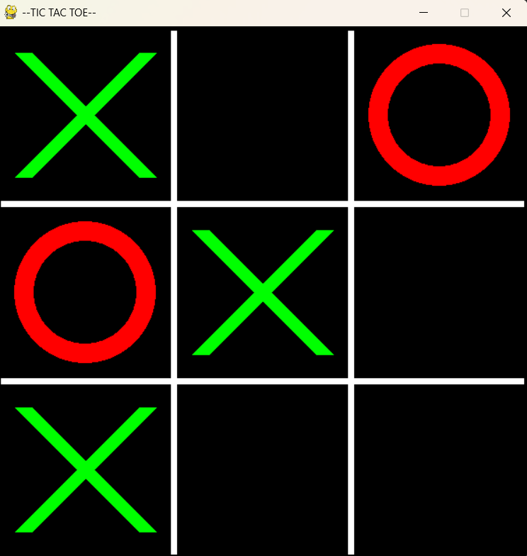
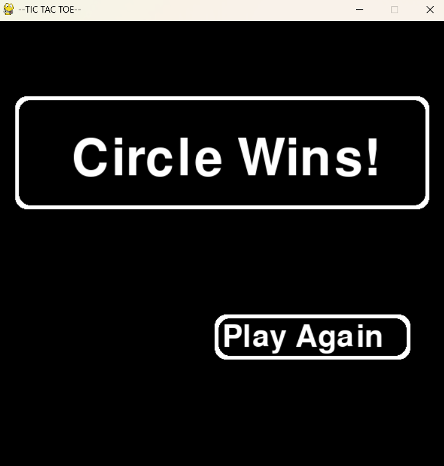
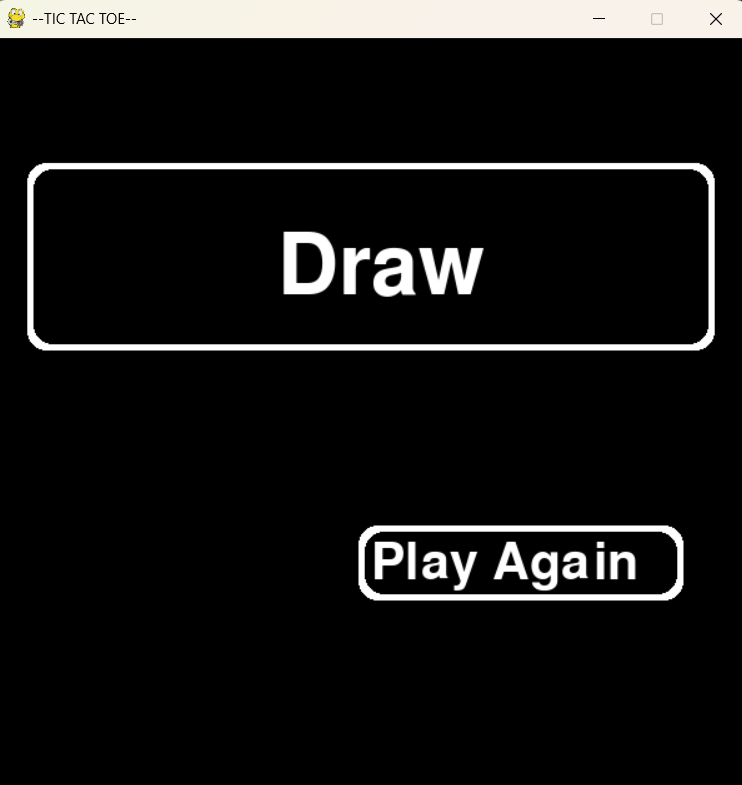

# Tic Tac Toe — Pygame

A classic two-player Tic Tac Toe game built with **Python**, using **Pygame** for the graphical interface and **NumPy** to manage and display the game board state in the terminal.

---
### View the code:
Game source code: tictactoe.py

---


### Game Grid



---

### Win Screen



---

### Draw Screen



---

## How It Works

The game board is represented as a **3×3 NumPy array** (`flags`), where:
- `0` = empty cell
- `1` = Cross (Player 1 / X)
- `-1` = Circle (Player 2 / O)

Every time a player makes a move, the updated board is printed to the **terminal**, giving a numeric view of the game state alongside the graphical display.

```
[[0 0 0]
 [0 0 0]
 [0 0 0]]
```

---

## Gameplay

- **Two players** take turns clicking on the grid.
- **Player 1** plays as ✖ (Green X)
- **Player 2** plays as ⭕ (Red Circle)
- The game detects wins across **rows**, **columns**, and **diagonals**.
- If all 9 cells are filled with no winner, the game ends in a **Draw**.
- A **Game Over screen** appears showing the result, with a **Play Again** button to restart.

---

## Win Conditions

The `check_winner()` function evaluates the board after every move by summing values:

| Condition | Sum | Result |
|-----------|-----|--------|
| Row of 3 crosses | `3` | Cross Wins |
| Row of 3 circles | `-3` | Circle Wins |
| Column of 3 crosses | `3` | Cross Wins |
| Column of 3 circles | `-3` | Circle Wins |
| Diagonal of 3 crosses | `3` | Cross Wins |
| Diagonal of 3 circles | `-3` | Circle Wins |
| All 9 cells filled, no winner | — | Draw |

---

## Requirements

- Python 3.x
- [Pygame](https://www.pygame.org/) — `pip install pygame`
- [NumPy](https://numpy.org/) — `pip install numpy`

---

## Key Implementation Details

### Grid Drawing
The grid is redrawn every frame using `pygame.draw.line()`, splitting the 600×600 window into a 3×3 layout with cells of 200×200 pixels each.

### Input Handling
Mouse click coordinates are divided by `200` to map directly to a row/column index in the NumPy array:
```python
flags[y_position // 200][x_position // 200] = player
```

### Player Switching
Players alternate by multiplying the current player value by `-1`:
```python
player *= -1
```

### Play Again
Clicking the **Play Again** button resets all variables — the board, winner, player turn, and game state — back to their initial values.

---

## Author

Made with ❤️ using Python, Pygame, and NumPy.